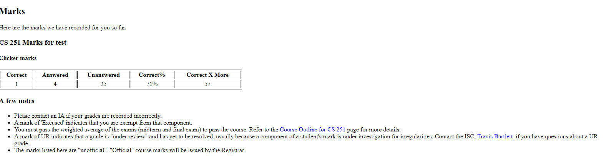

# clickerMe
clickerMe calculates clicker marks for UWCS students for convinence 

## Build
- `git clone https://github.com/wwxnff/clickerMe.git`

To run the extension, open `chrome://extensions` and enable `Developer mode`. Then click `Load unpacked extension` and navigate to the `src` directory. The extension will then be loaded.

Original Page

With clickerMe Page

Correct X more means to answer x more clicker questions correctly, you can get 100% in clicker marks